# AWS Event-Driven Architecture with .NET 8 & Kubernetes (Kind)

Este projeto demonstra uma arquitetura robusta de microserviços orientada a eventos, utilizando **.NET 8**, simulando serviços da **AWS** localmente e orquestrando tudo dentro de um cluster **Kubernetes** local.

## 🚀 Arquitetura do Sistema

O fluxo de dados segue o padrão de desacoplamento para garantir alta disponibilidade e resiliência:

1.  **Payment.API**: Recebe uma requisição POST, salva o pagamento com status `Pending` no **DynamoDB** e publica um evento no **SNS**.
2.  **SNS -> SQS**: O SNS encaminha a mensagem para uma fila **SQS** (Fan-out pattern).
3.  **Payment.Processor**: Um Worker Service (BackgroundService) que escuta a fila SQS, processa o pagamento e atualiza o status no DynamoDB para `Approved`.

```mermaid 
graph LR
    %% Atores
    Client([👤 Client])

    %% Agrupamento Kubernetes
    subgraph K8s ["☸️ Kubernetes Cluster"]
        API["🚀 Payment.API\n(.NET Web API)"]
    end

    %% Agrupamento AWS Services
    subgraph AWS ["☁️ AWS Managed Services"]
        DB[("🛢️ DynamoDB\n(Payments Table)")]
        SNS{{"📡 SNS Topic\n(PaymentCreated)"}}
        SQS[("📥 SQS Queue\n(PaymentProcessing)")]
    end

    %% Fluxo de Execução
    Client -- "POST /payments" --> API
    
    API -- "1. Save 'Pending'" --> DB
    API -- "2. Publish Event" --> SNS
    
    SNS -. "3. Forward" .-> SQS
    
    SQS -- "4. Poll Message" --> Worker
    Worker -- "5. Update 'Approved'" --> DB

    %% Estilização para ficar bonito no GitHub
    style API fill:#512bd4,stroke:#fff,color:#fff
    style Worker fill:#512bd4,stroke:#fff,color:#fff
    style SNS fill:#ff9900,stroke:#333,color:white
    style SQS fill:#ff9900,stroke:#333,color:white
    style DB fill:#2E7D32,stroke:#fff,color:white
```



## 🛠 Tecnologias Utilizadas

* **Linguagem**: .NET 8 (C#)
* **Mensageria**: AWS SNS & SQS (via LocalStack)
* **Banco de Dados**: Amazon DynamoDB
* **Orquestração**: Kubernetes (Kind)
* **Containers**: Docker

## 📦 Como Rodar o Projeto

### 1. Pré-requisitos
* Docker Desktop
* Kind (Kubernetes in Docker)
* kubectl
* AWS CLI (configurado com credenciais 'test')

### 2. Subir o Ambiente AWS (LocalStack)
```powershell
# Inicie o LocalStack via Docker Compose
docker-compose up -d


#Criar o Cluster Kubernetes
kind create cluster --name payment-system


# Build das imagens
docker build -t payment-api:latest .
docker build -t payment-processor:latest .

# Carregar imagens para dentro do Kind
kind load docker-image payment-api:latest --name payment-system
kind load docker-image payment-processor:latest --name payment-system

# Aplicar manifestos
kubectl apply -f k8s/


```


